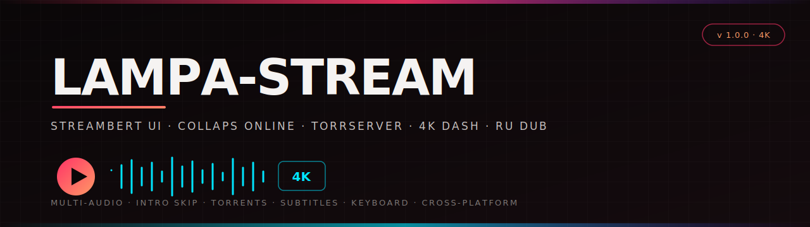

# Lampa-Stream

<p align="center"></p>

A cross-platform Electron desktop app that unifies **Streambert's polished GUI**
with **Lampa's content engine**: a multi-audio **online cinema** (Collaps, up to
4K DASH with Russian dubs) and a **torrent** source (TorrServer). No more
"English-only" embed players — pick a Russian dub, switch audio tracks, skip
anime intros, scrub with the keyboard, all in one place.

> Forked from [truelockmc/streambert](https://github.com/truelockmc/streambert)
> (GPL-3.0). The online &amp; torrent pipelines mirror Lampa Desktop's
> integration, reverse-engineered against the live Collaps and TorrServer APIs.

## Stack

| Layer | Tech |
|-|-|
| Desktop shell | Electron 40, Node 22+ |
| Renderer | React 18, Vite 7 |
| Player engines | dash.js 4.7 (DASH / 4K), hls.js 1.5 (HLS fallback) |
| Catalog | TMDB (metadata, images, search), AniList (anime) |
| Online source | Collaps (`api.delivembd.ws`) — multi-audio DASH/HLS |
| Torrent source | TorrServer (YouROK MatriX) + Jackett (optional autosearch) |
| Anime intro skip | AniSkip (via AniList idMal) |
| Build/pack | electron-builder (deb/rpm/AppImage/pacman, Windows NSIS, macOS dmg) |

## Prerequisites

- **Node.js ≥ 22.12.0**
- A **TMDB** Read Access Token (free) — [guide](tmdb-tutorial.md). Asked on first run.
- For the **Торренты** source: a local **TorrServer** (YouROK MatriX) running on
  `http://127.0.0.1:8090` (or set its URL in Settings → TorrServer).
- For **autosearch** of torrents (optional): a **Jackett** instance + API key.
  Without it you can still paste magnet links / `.torrent` files manually.
- For the **↗ external player** fallback on torrents: **mpv** or **VLC**.

## Install

```bash
git clone https://github.com/<your-user>/lampa-stream.git
cd lampa-stream
npm install
```

> **Electron binary note:** on some networks the `electron` npm postinstall
> fails to download its binary (registry/mirror issues). If `npm start` errors
> with "Electron failed to install correctly", download
> `electron-v<version>-linux-x64.zip` from
> https://github.com/electron/electron/releases, extract it into
> `node_modules/electron/dist/`, and write `electron` into
> `node_modules/electron/path.txt`. The bundled binary needs
> `LD_LIBRARY_PATH=$PWD/node_modules/electron/dist` on Linux (the `launch.sh`
> script sets this for you).

## First run

```bash
./launch.sh        # Linux: sets LD_LIBRARY_PATH + DISPLAY, runs electron
# or:
npm start          # any OS: vite build && electron .
```

On first launch you'll be prompted for a **TMDB Read Access Token**. It's stored
encrypted in the OS keychain (Electron `safeStorage`), never in plaintext.

## Player sources

Open any movie or TV episode → **Play** → click the **source** button (left
overlay) → choose:

### Russian-audio sources (added by Lampa-Stream)

| Source | id | Engine | Max quality | Russian audio | Needs |
|-|-|-|-|-|-|
| Онлайн (Collaps) | `online` | dash.js → hls.js fallback | **4K** (DASH) | ✓ multi-dub, switchable | nothing (works out of the box) |
| Торренты (TorrServer) | `torrserver` | hls.js + raw + mpv/VLC fallback | source-dependent | ✓ from torrent content | local TorrServer (+ Jackett for autosearch) |

### Upstream Streambert sources (kept as fallbacks)

| Source | id | Note |
|-|-|-|
| Videasy | `videasy` | embed player |
| VidSrc | `vidsrc` | embed player |
| Vidking | `vidking` | embed player |
| AllManga | `allmanga` | anime, `.mp4` direct |

## Player features

| Feature | Online | Torrents | How |
|-|-|-|-|
| Audio-track switching | ✓ | ✓ (when HLS) | 🎵 button / `A` key |
| Russian dub default | ✓ | ✓ | auto-selected on load |
| Quality selector | ✓ 4K/1080p/720p/… + Auto | ✓ | quality button / `Q` key |
| Playback speed | ✓ | ✓ | ⚙ button / `<` `>` keys (0.5×–2×) |
| Subtitles | ✓ (Collaps `cc` VTT) | — | CC button / `C` key |
| Intro/outro skip | ✓ anime (AniSkip) | — | "ПРОПУСТИТЬ ИНТРО" button, auto or manual |
| ±10s seek | ✓ | ✓ | ◀10 / 10▶ buttons, `←` `→` `J` `L` |
| Resume position | ✓ | ✓ | seeks to last watched % on load |
| Buffer bar + hover time | ✓ | ✓ | hover the seek bar |
| Auto-hide controls | ✓ | ✓ | 3s idle while playing |
| Click-to-play / dbl-click fullscreen | ✓ | ✓ | on the video |
| Loading spinner | ✓ | ✓ | while buffering |
| External player | — | ✓ (mpv/VLC) | ↗ button — guaranteed RU audio on any mkv |

## Keyboard shortcuts

| Key | Action |
|-|-|
| `Space` / `K` | play / pause |
| `←` / `J` | back 10s |
| `→` / `L` | forward 10s |
| `↑` / `↓` | volume ±5% |
| `0`–`9` | seek to N×10% |
| `F` | toggle fullscreen |
| `M` | mute |
| `<` / `>` | speed − / + |
| `C` | cycle subtitles |
| `A` | cycle audio track |
| `Q` | cycle quality |

## Settings → TorrServer

| Field | Purpose |
|-|-|
| TorrServer URL | host of your local TorrServer (default `http://127.0.0.1:8090`) |
| Проверить | health-check, detects MatriX build |
| Jackett URL + API key | autosearch torrents (any Jackett-compatible indexer) |
| Предпочитаемая аудиодорожка | RU / EN / original |
| Внешний плеер | auto / mpv / VLC for the ↗ fallback |

Config persists to `userData/lampa-stream-torrserver.json` (gitignored, may hold
your Jackett key).

## How the 4K + Russian audio works

**Онлайн (Collaps):** the TMDB item is resolved to a Collaps embed via `imdb_id`
(falls back to `kinopoisk_id` by title when TMDB has no imdb_id). The embed page
contains a `makePlayer({...})` object with the DASH `.mpd` URL and an audio-name
array. The DASH manifest carries up to **2160p (4K)** + multiple audio
renditions (RU dubs as separate tracks). The in-app **dash.js** player plays it,
defaulting to the best quality and a Russian dub. If DASH fails, it falls back
to hls.js on the HLS URL (~720p). The Collaps CDN blocks Electron's User-Agent,
so the main process rewrites the UA to plain Chrome for its hosts
(`*.interkh.com`, `api.delivembd.ws`) and injects permissive CORS headers.

**Торренты (TorrServer):** Russian audio comes from the torrent content itself
(RU dubs in the mkv). TorrServer MatriX serves the **raw** stream by default
(not multi-audio HLS), so the in-app player falls back to raw mp4 playback and
offers an mpv/VLC button (which always handles any container + any audio track).

## Security &amp; privacy

- **No tracking, no ads** (inherited from Streambert — built-in ad/tracker
  blocklist for the embed sources).
- TMDB / Jackett / Wyzie / SubDL keys stored **encrypted** via Electron
  `safeStorage` (OS keychain), never in plaintext or localStorage.
- TorrServer config (`lampa-stream-torrserver.json`) lives in `userData` and is
  gitignored; it may hold your Jackett key — don't share it.
- The app is a **search/aggregation engine** — it hosts no content. See the
  legal disclaimer below.

## Development

```bash
npm install
npm run dev          # vite build --watch (rebuild renderer on change)
npm start            # build + launch electron
```

Build a distributable:

```bash
npm run dist:linux      # deb / rpm / AppImage / pacman
npm run dist:appimage   # AppImage only
npm run dist:win        # Windows NSIS
npm run dist:mac        # macOS dmg (universal)
npm run dist            # all platforms
```

Project layout:

```
src/
├── components/
│   ├── OnlinePlayer.jsx       # online source: dash.js → hls.js, 4K, all controls
│   ├── TorrPlayer.jsx         # torrent source: search / add magnet / TorrServer
│   └── TorrServerSettingsSection.jsx
├── ipc/
│   ├── collaps.js             # main-process Collaps parser (makePlayer → DASH/HLS)
│   └── torrserver.js          # main-process TorrServer client + Jackett + mpv/VLC
├── utils/
│   ├── collaps-client.js      # renderer IPC wrapper + RU-audio picker
│   └── torrserver-client.js
└── pages/  (MoviePage, TVPage, SettingsPage, …)  # from Streambert
public/vendor/dash.all.min.js  # dash.js bundle (npm registry ships broken pkg)
index.js  preload.js           # Electron main + secure bridge
launch.sh  kill.sh             # Linux launcher + force-kill helper
```

## Changelog

- **v1.0.0** — Lampa-Stream. Added the Collaps `Онлайн` source (4K DASH,
  multi-audio RU dubs, AniSkip intro skip, subtitles, quality/speed/seek,
  full keyboard control, resume) and the TorrServer `Торренты` source
  (Jackett autosearch, magnet/`.torrent` add, mpv/VLC fallback), both as in-app
  hls.js/dash.js players. Forked from Streambert 2.5.0.

## License

GPL-3.0 (inherited from Streambert). Forks must stay open-source.

## Legal disclaimer

This application is for educational and personal use only. It does not host,
store, or distribute any copyrighted content — all content is sourced from
third-party providers (Collaps, TorrServer torrents you add, VidSrc/Videasy
embeds). Users are responsible for ensuring they have legal rights to access any
content and must comply with all applicable laws in their jurisdiction. The
developer does not endorse copyright infringement.

---

## RU — кратко

Объединяет **GUI Streambert** с **контент-движком Lampa**: онлайн-кинотеатр
**Collaps** (до 4K DASH, русская озвучка, переключение дорожек) и источник
**Торренты** (TorrServer). Больше никаких embed-плееров только с английским
звуком.

**Запуск:** `npm install` → `./launch.sh` (Linux) или `npm start`. При первом
запуске спросит TMDB-токен. Открой фильм/серию → Play → кнопка источника →
**«Онлайн»** (4K, русская озвучка, без подготовки) или **«Торренты»** (через
локальный TorrServer, ищи через Jackett или вставь magnet).

**Фишки плеера:** качество (4K/…/Авто), скорость (0.5×–2×), субтитры, скип
интро в аниме (AniSkip), перемотка ±10с, перемотка на позицию, полный набор
горячих клавиш (см. таблицу выше), авто-скрытие контролей.

**Безопасность:** без рекламы и трекеров, ключи хранятся в OS-keychain
(encrypted), TorrServer-конфиг с твоим Jackett-ключом в `userData` и не
пушится. Полная таблица фич — в EN-секции выше.

---

## ZH — 简介

将 **Streambert 的界面** 与 **Lampa 的内容引擎** 合二为一：在线影院
**Collaps**（最高 4K DASH，俄语配音，可切换音轨）和 **TorrServer 种子**
来源。不再受限于只有英语音轨的嵌入播放器。

**运行：** `npm install` → `./launch.sh`（Linux）或 `npm start`。首次启动
会要求输入 TMDB token。打开电影/剧集 → 播放 → 来源按钮 → **«Онлайн»**
（4K，俄语配音，开箱即用）或 **«Торренты»**（通过本地 TorrServer，可用
Jackett 搜索或粘贴磁力链接）。

**播放器功能：** 画质（4K/…/自动）、倍速（0.5×–2×）、字幕、动漫片头跳过
（AniSkip）、±10 秒快进/退、续播位置、完整快捷键（见上方表格）、控件自动
隐藏。

**安全：** 无广告无追踪，密钥经 OS keychain 加密存储，TorrServer 配置
（含你的 Jackett key）在 `userData` 且不上传。完整功能表见上方 EN 部分。
